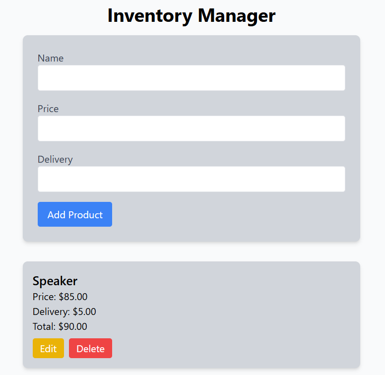

# Product Inventory Frontend

A simple and intuitive web application for managing a product inventory. This frontend serves as a user interface to interact with an [Express.js backend](https://github.com/Cema2019/sales-api) and a [FastAPI backend](https://github.com/Cema2019/product-inventory-backend), enabling CRUD (Create, Read, Update, Delete) operations on sales items.


## ✨ Features

- **Display Sales:** Fetch and display a list of all sales items with price, delivery, and total.
- **Add New Sales:** Fill out a form to create and add new sales items to the database.
- **Update Sales:** Edit existing sales items directly from the list.
- **Delete Sales:** Remove sales items from the database.
- **Responsive UI:** Clean, responsive design built with Tailwind CSS.
- **Form Validation & Error Handling:** Ensures input correctness and shows errors for failed API calls.

## 🖼 Screenshot



## 🚀 Getting Started

Follow these instructions to get the project running locally.

### Prerequisites

Ensure you have the following installed:

- **Node.js** (LTS version recommended)
- **npm** or **Yarn**

### Installation

1. Clone the repository:

```bash
git clone https://github.com/Cema2019/sales-frontend.git
cd sales-frontend
```

2. Install dependencies:

```bash
npm install
```

or

```bash
yarn
```

### Configuration

This frontend application is designed to work with a backend API whether Express.js or FastAPI. Make sure the backend server is running at:

```
http://localhost:3000
```

CORS must be enabled on the backend for `http://localhost:5173`.

### Running the App

To start the development server:

```bash
npm run dev
```

The application will open in your browser at:

```
http://localhost:5173
```

## 🧩 Technologies Used

- **React** – Library for building user interfaces.
- **TypeScript** – Strongly typed language built on JavaScript.
- **Tailwind CSS** – Utility-first CSS framework for rapid UI development.
- **Fetch API** – For making API requests to the backend.

## 📝 Usage

- **Add Product:** Fill in `Name`, `Price`, and `Delivery`, then click **Add Product**.
- **Edit Product:** Click **Edit**, modify the fields, then click **Update Product**.
- **Delete Product:** Click **Delete** to remove a product.
- **Reset Form:** Click **Reset** to cancel editing.

## 📄 License

MIT
